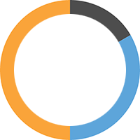
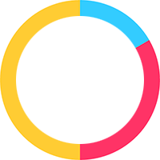

create-svg-doughnut
==============
[](https://travis-ci.org/janjarfalk/create-svg-doughnut)

Create a SVG doughnut chart from number array.

## Installation
```sh
npm install create-svg-doughnut --save
```

## Usage
```js
import createSVGDoughnut from 'create-svg-doughnut';

const values = [5, 10, 15];
const outerRadius = 100;
const innerRadius = 80;

// Doughnut with default colors
const doughnut = createSVGDoughnut(values, outerRadius, innerRadius);
document.body.appendChild(doughnut);

// Doughnut with custom colors
const palette = ['#3cf','#f36','#fc3'];
const customDoughnut = createSVGDoughnut(values, outerRadius, innerRadius, palette);
document.body.appendChild(customDoughnut);

```
## Example HTML output
```html
<!-- Pie with default colors -->
<svg width="200" height="200" viewBox="0 0 200 200">
    <path d="M100,100  L100,0  A100,100 0 0,1 186.60254037844388,50.00000000000001 z" fill="#4D4D4D" mask="url(#hole)"></path>
    <path d="M100,100  L186.60254037844388,50.00000000000001  A100,100 0 0,1 100,200 z" fill="#5DA5DA" mask="url(#hole)"></path>
    <path d="M100,100  L100,200  A100,100 0 0,1 99.99999999999999,0 z" fill="#FAA43A" mask="url(#hole)"></path>
    <defs>
        <mask id="hole">
            <rect width="100%" height="100%" fill="white"></rect>
            <circle cx="100" cy="100" r="80"></circle>
        </mask>
    </defs>
</svg>

<!-- Pie with custom colors -->
<svg width="200" height="200" viewBox="0 0 200 200">
    <path d="M100,100  L100,0  A100,100 0 0,1 186.60254037844388,50.00000000000001 z" fill="#3cf" mask="url(#hole)"></path>
    <path d="M100,100  L186.60254037844388,50.00000000000001  A100,100 0 0,1 100,200 z" fill="#f36" mask="url(#hole)"></path>
    <path d="M100,100  L100,200  A100,100 0 0,1 99.99999999999999,0 z" fill="#fc3" mask="url(#hole)"></path>
    <defs>
        <mask id="hole">
            <rect width="100%" height="100%" fill="white"></rect>
            <circle cx="100" cy="100" r="80"></circle>
        </mask>
    </defs>
</svg>
```

## Example image output




## Contributing

In lieu of a formal styleguide, take care to maintain the existing coding style.
Add unit tests for any new or changed functionality. Lint and test your code.

## Release History

* 1.0.0 Initial release

## Todo
- Create useful tests
